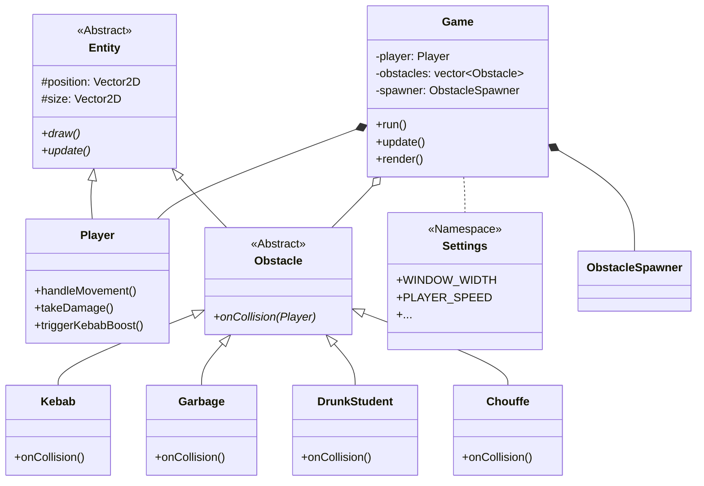

# 🏄 Carré Surfer - Projet de Programmation C++

Bienvenue dans **Carré Surfer**, un jeu d'arcade rapide et nerveux développé en C++. Vous incarnez Thomas, un étudiant qui doit survivre le plus longtemps possible dans les rues pavées de Louvain-la-Neuve, en évitant les obstacles et en ramassant des bonus.

---

## 🏗️ Architecture du Code

Le projet est structuré selon une architecture orientée objet rigoureuse, séparant la logique de jeu du moteur de rendu.

### 📊 Diagramme de Classes



---

## 🧩 Utilité des Classes

### 🎮 Cœur du Jeu
*   **`Game`** : C'est le chef d'orchestre. Il contient la boucle principale (`run`), gère la machine à états (Jeu, Pause, Game Over) et délègue les tâches aux autres systèmes.
*   **`Settings`** : Un espace de nom centralisant toute la configuration (vitesse, dégâts, probabilités). C'est le "tableau de bord" du jeu.

### 👤 Entités et Obstacles
*   **`Player`** : Gère l'état de Thomas (santé, position, effets). Il implémente les mécaniques spéciales comme le boost Kebab (agrandissement et invincibilité).
*   **`Obstacle` (Base)** : Classe abstraite définissant le comportement commun de tout ce qui défile à l'écran.
*   **`Kebab`** : Un bonus de soin qui déclenche un mode "Super Thomas" (Vitesse + Invincibilité).
*   **`DrunkStudent`** : Un obstacle violet qui inflige des dégâts et inverse les contrôles du joueur (Confusion).
*   **`Chouffe`** : Une bière spéciale qui nettoie instantanément tout l'écran en cas de collision.

### ⚙️ Systèmes Techniques
*   **`ObstacleSpawner`** : Gère la génération procédurale. Il augmente progressivement la vitesse et la densité des obstacles au fil du temps.
*   **`CollisionManager`** : Utilise l'algorithme AABB (Axis-Aligned Bounding Box) pour détecter les chocs entre Thomas et les obstacles.
*   **`ScoreManager`** : Calcule le score en fonction du temps et gère la sauvegarde du record dans `highscore.txt`.
*   **`BackgroundManager`** : Gère l'effet de parallaxe (défilement du décor à différentes vitesses) pour donner une impression de profondeur.
*   **`TextRenderer`** : Un moteur de rendu de texte pixel-art "custom" qui dessine chaque lettre pixel par pixel.

---

## 🚀 Comment Jouer ?

### Commandes
*   **Flèches Directionnelles** : Déplacer Thomas.
*   **[ESPACE]** : Mettre en pause / Recommencer.
*   **[ECHAP]** : Quitter le jeu.

### Compilation
Le projet utilise un `Makefile` pour simplifier la compilation sur Linux.

```bash
# Pour compiler le jeu
make

# Pour lancer le jeu
./game

# Pour nettoyer les fichiers temporaires
make clean
```

### Dépendances
*   Un compilateur C++ compatible C++17 (ex: `g++`).
*   Les bibliothèques systèmes Linux classiques (`libwayland-client`).

---

## 🎨 Design et Esthétique
Le jeu utilise un style minimaliste "Carré" avec des effets modernes :
*   **Screen Shake** : L'écran tremble lors des chocs.
*   **Transitions** : Les menus utilisent de l'Alpha Blending (transparence) pour assombrir le jeu en arrière-plan.
*   **Feedback Visuel** : Particules et textes flottants lors de la prise de bonus.