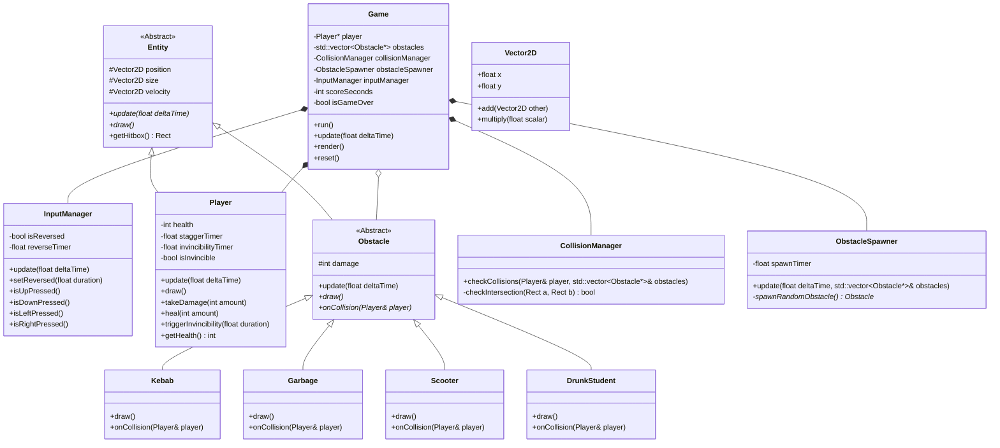

# Diagramme de Classes : Carré Surfer

Ce diagramme illustre l'architecture orientée objet (POO) du jeu, découpée en modules logiques (packages) pour respecter le principe de responsabilité unique.

## Explication des Modules (Packages)

L'architecture est découpée en 5 modules principaux pour garantir une bonne séparation des responsabilités (Single Responsibility Principle) et faciliter le travail à deux via Git :

1. **`engine` (Le moteur du jeu)**
   - `Game` : Classe centrale. Gère la boucle principale du jeu (`update`, `render`), possède les autres managers et l'état global du jeu (Score, Game Over).
   - `InputManager` : Isole la logique de gestion des touches du clavier. C'est ici que l'on implémentera l'inversion des touches causée par l'étudiant ivre, pour ne pas polluer la classe `Player` ou `Game` avec cette logique.

2. **`entities` (Les entités de base)**
   - `Entity` : Classe abstraite contenant la logique de base de tout objet visible à l'écran (position, taille, vitesse, `getHitbox()`).
   - `Player` : Hérite de `Entity`. Implémente la logique spécifique à Thomas : sa santé, son état d'invincibilité, et sa tendance à tituber (stagger).

3. **`obstacles` (Les obstacles spécifiques)**
   - `Obstacle` : Hérite de `Entity`. Classe de base pour tous les objets que le joueur croise. Elle définit une méthode virtuelle pure `onCollision()` que chaque sous-classe implémentera.
   - `Kebab`, `Garbage`, `Scooter`, `DrunkStudent` : Classes concrètes qui héritent d'`Obstacle`. Le polymorphisme permet au jeu de traiter tous les obstacles de manière générique (`std::vector<Obstacle*>`), tout en exécutant un effet spécifique au contact.

4. **`systems` (La logique transversale)**
   - `CollisionManager` : Gère de façon isolée la physique et la détection de collisions entre les boîtes de collision (hitboxes) du joueur et des obstacles.
   - `ObstacleSpawner` : Responsable du frai (spawn) aléatoire des obstacles à l'écran, selon les probabilités dictées dans l'énoncé (20% kebab, etc.).

5. **`utils` (Les utilitaires)**
   - `Vector2D` : Structure simple pour gérer des positions et vecteurs proprement (mathématiques 2D).
   - `Constants` : Regroupe toutes les valeurs magiques (tailles, couleurs, vitesses) pour éviter les variables globales éparpillées.
